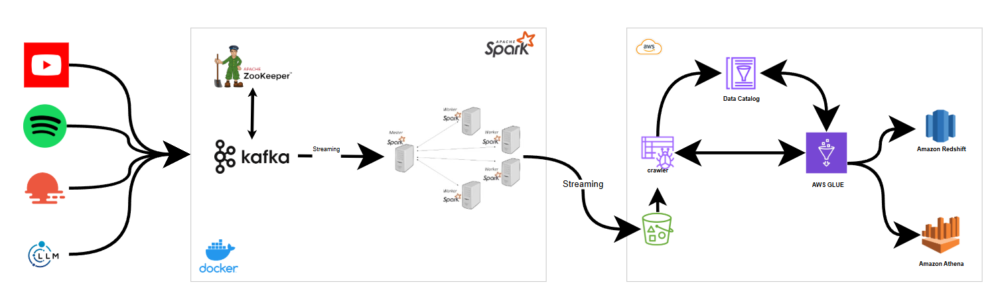

# 🛢 Youtube-Data-Streaming-Pipeline

A real-time data streaming application that extracts data from multiple sources, processes it through Kafka and Apache Spark, and stores it in an S3 bucket for further analysis.



## 📖 Table of Contents
- [⚙️ Features](#️-features)
- [🛠️ Tech Stack](#️-tech-stack)
- [🚀 Installation](#️-installation)
- [🤝 Contributing](#️-contributing)
- [📃 License](#️-license)

## ⚙️ Features

- **Multi-Source Data Extraction**: Collects data from YouTube API, Spotify API, and OpenWeather API.
- **Real-Time Data Processing**: Utilizes Kafka for message streaming and Apache Spark for data processing.
- **Scalable Architecture**: Runs in a containerized environment using Docker.

## 🛠️ Tech Stack  

This project utilizes the following technologies:

- **Data Sources**: YouTube API, Spotify API, OpenWeather API
- **Streaming & Processing**: Apache Kafka, Apache Spark
- **Containerization**: Docker
- **Storage**: Amazon S3
- **Prompting**: LLM Model

## 🚀 Installation

Follow the steps below to run the project locally:

### 1. Clone the Repository  

```bash
git clone https://github.com/PhamAnhTienn/Youtube-Data-Streaming-Pipeline.git
cd Youtube-Data-Streaming-Pipeline
```

### 2. Build and Start the Docker Containers
Ensure Docker is installed, then run:

```bash
docker-compose up --build
```

### 3. Access the Application
Once the setup is complete, start the data streaming process:

```bash
cd jobs
python main.py
```

## 🤝 Contributing

This project is open to contributions. Please feel free to submit a PR.

## 📃 License

This project is provided under an MIT license. See the [LICENSE](LICENSE) file for details.